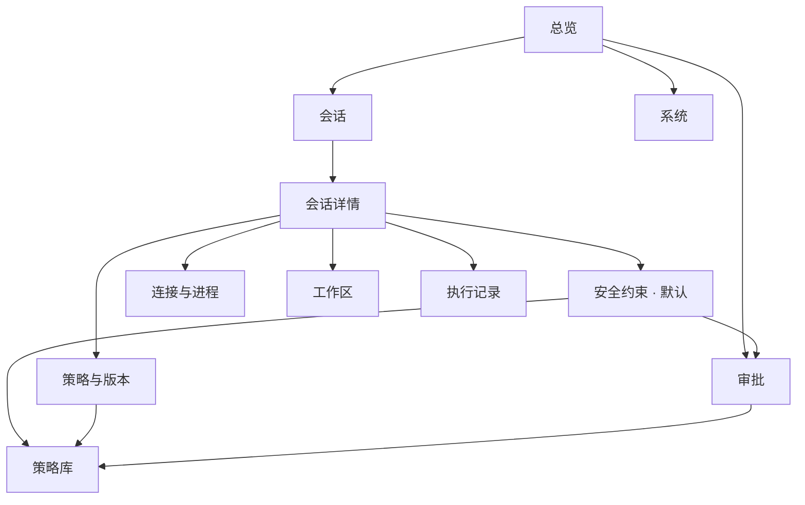

# AgentScope 界面重设计：以会话为中心的安全约束可视化

> 版本：v1（2026-10-08）  
> 对象：AgentScope 管理界面（`frontend/`）的整体信息架构与关键页面重设计  
> 依据：`AgentScope_策略管控系统功能模块技术设计.docx` 第 5.2、6 节；`AgentScope_运行时Scope增量与策略生成技术方案.md` 第 13 节；`AgentScope_历史策略库模块技术规划.md` 第 10 节；现有实现 `frontend/src`、`backend/agentscope_app/managed`、`scope`、`workspaces`。  
> 原型：`docs/prototype/AgentScope-界面原型-会话安全约束.html`（直接双击打开即可，用于演示与评审）。
> 原型首屏已做静态预渲染：即使在 QuickLook、预览面板等不执行 JavaScript 的查看器里也能看到完整界面。

---

## 0. 结论摘要

**一句话定位**：把"策略都在后台跑"变成"**每个会话都有一张看得见的安全清单**"。

三个核心改动：

1. **信息架构改为会话为中心**：一级导航从 6 项收敛为 5 项（总览 / 会话 / 审批 / 策略库 / 系统）。"会话"是唯一的运行单位，Agent、工作区、进程、约束、事件、策略版本全部挂在会话下，不再散落 5 个页面。
2. **新增"安全约束"页**（会话详情的默认标签）：用 APP 权限列表的语言，把每个会话当前生效的安全约束一次列清；每一项标明**强制力**（内核拦截 / 工具前拦截 / 仅提醒）、**来源**（平台 / 任务 / 你会话内调整 / Agent 动态提交）、**可操作性**（锁定 / 需审批 / 可直接改）。用户用勾选、单选、文本框就地调整；Agent 动态提交的约束以"变更申请卡"进入同一列表和审批中心。
3. **新增"连接与进程"树**：按你给的树状图展示 `平台底线 → 任务域 → 子 Agent 域 → 进程树`，并旁挂工作区与会话；每个节点带**定位标签**（`TASK-` / `SESS-` / `DOM-` / `AGENT-` / `PID-` / `WS-` / `CON-` / `POL-v`），可点击或复制用于定位。提供**讲解模式 / 核验模式**切换：讲解模式画出完整继承模型（供参观者理解），核验模式只显示有加载回执与核验证据的节点——两者都标注证据状态，**绝不补画不存在的全局 D0**。

同时删掉四类东西：**重复标题、JSON 倾倒、15 字段抽屉、写死仓库的 demo 工作台**。

**访客 30 秒验收脚本**：打开总览 → 点"运行中会话"第一条 → 默认落在安全约束 → 读结论条三句话（能改什么 / 什么被保护 / 有几条等在批）→ 切到"连接与进程"看树 → 每个节点都有名字和标签。全程不需要解释"域""代次""回执"这些词。

---

## 1. 现状问题诊断

对照现有代码逐条定位，每一条都是可验证的行为，不是感觉。

| # | 问题 | 代码证据 | 后果 |
|---|---|---|---|
| 1 | **同一个标题最多出现 4 次** | `main.jsx:114` topbar 渲染 `pageTitle(page)`；`main.jsx:128` 的 `Header` 再渲染 `<h1>{title}</h1>` + `eyebrow`；`AgentWorkspaces.jsx` 又写 `<h1>Agent连接</h1>`；`ScopeWorkbench.jsx` 又写 `<h1>Agent 动态权限演示</h1>` | 首屏顶部三分之一被标题和面包屑吃掉，用户要滚动才看到功能；模块名重复 |
| 2 | **字段自上而下倾倒** | `AgentWorkspaces.jsx` 的 `ConnectionEvidence` 一次渲染 **15 组** `dt/dd`（实例ID、管理模式、进程启动标识、实例代次、检查序号、证据年龄、能力、检查错误…）；`AgentBridge.jsx` 多处 `<pre>{JSON.stringify(...,null,2)}</pre>`；`ScopeWorkbench.jsx` 每个抽屉都挂一个「技术证据」`<pre>` | 用户要从 15 个字段里自己判断"这个会话到底能不能写文件"；信息密度高但答案密度低 |
| 3 | **"连接"散落在 5 处** | `AgentWorkspaces`（实例+工作区）、`ConnectionHistory`（连接历史）、`AgentBridge`（任务级 HTTP 凭据）、`TaskArchiveDetails`（任务回放）、`DomainGraph`（域与进程）；`navigation.mjs` 里 `agent` 默认写死 `'native-dsh'` | "这个会话连的哪个 Agent、哪个工作区、哪个会话"要跨 3 个页面拼；会话 ID 只在抽屉的"核验标识"里出现 |
| 4 | **没有会话级安全检查入口** | 全站没有"某个任务的当前安全约束"视图；唯一像权限表的是 `ScopeWorkbench`，但它在 `reload()` 里把任务过滤成 `t.repo==='AgentScope/custom-scope-demo'`，只服务一个演示仓库 | 正中老板说的："我开了一个会话，却没有入口对它做安全检查或可视化配置" |
| 5 | **术语门槛** | 域 / 底线 / 代次 / 回执 / 核验 / 候选 / 冻结 / 收据 | 参观者看不懂，必须有人口头翻译；这就是"不能告诉他说 xxx 都在后台跑"的根源 |
| 6 | **导航与挂载混乱** | 一级 6 项混了三层语义（总览/连接/工作台/历史/策略库/治理）；`main.jsx:116-120` 用 `hidden` 属性把所有页面同时挂载 | 学习成本高、首屏请求多、语义定位靠猜 |
| 7 | **状态语义混淆** | `已编译`、`已加载`、`已核验`、`发生过真实拦截`在代码里是四个不同事实（`records.py:72-73`、`topology.py:77`），但界面上都以"标签"平铺，缺少一句话解释 | 用户把"编译通过"误读成"已经拦住" |

**根因**：现有界面按**后端模块**组织（连接模块、工作台模块、历史模块、策略库模块），而不是按**用户的一个问题**组织。用户的问题是"我这个会话现在安全吗、能改哪里、谁在等我批"，页面却按数据库表分工。

---

## 2. 设计目标与原则

### 2.1 目标（可验收）

| 目标 | 验收方式 |
|---|---|
| 访客 30 秒看懂 | 不讲解的情况下，访客能说出"这个会话能改哪些目录、哪些被保护" |
| 一页一个问题 | 每个一级页面用一句疑问句命名：现在在跑什么 / 这个会话安全吗 / 有什么等我批 / 这些约束从哪来 / 底层能不能真拦 |
| 约束可操作 | 用户能在会话内勾选/单选/填文本调整会话级约束，并看到生效状态 |
| Agent 动态可见 | Agent 提交的约束以"变更申请卡"出现在同一列表，带差异、原因、进度 |
| 连接可定位 | 树上的每个 Agent / 工作区 / 会话 / 进程都有稳定标签，可点击或复制定位 |
| 不撒谎 | 每条约束标明强制力等级与证据状态；无证据的节点显式标注"未取得"，不补画 |

### 2.2 设计原则

- **P1 会话是唯一的运行单位。** 一次任务的一次运行 = 一个会话。Agent、工作区、进程、约束、事件、策略版本都从属于会话。
- **P2 一页一功能。** 每个页面只回答一个问题；一个页面上的区块不超过 5 个。
- **P3 标题只出现一次。** 由导航壳统一渲染，页面组件不再输出 `<h1>`；只有抽屉与弹窗有标题。
- **P4 摘要先行，细节进抽屉。** 列表行 ≤ 4 个字段；卡片 ≤ 5 个字段；抽屉 ≤ 7 个字段；原始 JSON 一律收进默认折叠的「技术证据」。
- **P5 结构化记录，统一卡片。** 所有条目（约束、事件、审批、策略、工作区）使用同一套记录卡语法：`标题 / 状态徽章 / 一行摘要 / 标签行 / 一个主操作`。
- **P6 继承关系可视。** 用树表达 `谁继承谁`，每个节点带定位标签与"本节点新增几条约束"。
- **P7 用权限清单的语言。** 不说"Scope revision"，说"可写范围"；不说"DSL 候选"，说"准备新增的限制"。
- **P8 状态只说三种真相。** 「内核会拦」「操作前拦」「只是提醒」三档强制力必须分开显示；`已编译 / 已加载 / 已核验 / 曾拦截` 各自带一句白话解释。

---

## 3. 新信息架构

### 3.1 一级导航（5 项）

| 序号 | 页面 | 唯一功能（回答的问题） | 首屏字段上限 |
|---|---|---|---|
| 1 | **总览** | 现在系统在跑什么，有没有需要我处理的风险 | 4 个指标 + 3 条会话摘要 |
| 2 | **会话** | 每个会话当前安全吗（含运行中 / 已结束 / 未受管实例） | 列表行 4 字段 |
| 3 | **审批** | 有什么在等我决定（约束变更 / 策略包 / 治理候选） | 每卡 5 字段 |
| 4 | **策略库** | 这些约束是从哪来的（原文、来源、层级） | 表格 5 列 |
| 5 | **系统** | 底层能力够不够，能不能真拦住 | 能力清单 6 行 |

被删除/合并的旧入口：
- `Agent连接` → 拆入「会话 → 连接与进程」与「会话列表 → 未受管实例」。
- `策略工作台` → 并入「会话」的创建流程与详情标签，不再是独立一级页。
- `任务历史` → 成为「会话」列表的一个状态筛选（已结束）。
- `持久治理` → 并入「审批」的一个来源分组。

### 3.2 会话详情（5 个标签，每个标签一个功能）

| 标签 | 唯一功能 | 主要数据 |
|---|---|---|
| **安全约束**（默认） | 这个会话现在允许什么、禁止什么、谁定的 | `scope-manager` + `strategy-records` + `workbench.resources` |
| **连接与进程** | 谁在跑、继承自谁、挂在哪个工作区与会话 | `domain-graph` + `workspace-tasks` + `workbench.execution.processes` |
| **工作区** | 这个会话能看见哪些文件 | `agent-workspaces/{id}/files` |
| **执行记录** | 实际发生了什么（内核拦截 / 工具调用 / 控制面） | `execution-audit` |
| **策略与版本** | 约束的版本历史与批准链 | `versions` + `strategy-records` 详情 |

### 3.3 页面地图



---

## 4. 安全约束模型（本次重设计的核心）

### 4.1 三级来源

| 级别 | 名称 | 谁能改 | 界面表现 |
|---|---|---|---|
| L0 | **平台底线** | 谁都改不了 | 🔒 灰色锁定行 + "为什么"链接 |
| L1 | **任务授权** | 需你在审批里确认 | 蓝色行 + 「申请调整」按钮 |
| L2 | **会话内调整** | 你可以直接改 | 可交互控件（单选 / 复选 / 文本），改完立即提交候选 |
| L2′ | **Agent 动态提交** | Agent 提议、你批准 | 独立的「变更申请卡」插入列表顶部 |

> 级联规则必须在界面上写死一句话：**"收紧可以立即生效；放宽需要重启会话。"**（对应后端"扩权需新版本/新域"的真实约束，`managed/controller.py` 的 expansion 流程。）

### 4.2 一条约束记录只显示 6 个字段

| 字段 | 白话 | 来源（后端） |
|---|---|---|
| 对象 | 对什么（目录 / 命令 / 网络 / 密钥） | `targets` / `resources` |
| 动作 | 能做什么（读取 / 写入 / 删除 / 执行） | `operations` |
| 权限 | 允许 / 只读 / 禁止 / 待审批 | `effect` + `allowed_write_dirs` |
| 强制力 | 内核拦截 / 工具前拦截 / 仅提醒 | `policy_type` + `compilation.status` + `loading.loaded` |
| 来源 | 平台底线 / 任务授权 / 你会话内改 / Agent 提交 | `origin` / `trigger` / `evidence` |
| 为什么 | 一句话解释 | `explanation` / `context_reason` |

其余全部下沉到「详情」抽屉，且原始 JSON 折叠。

### 4.3 强制力三档（必须分开显示）

| 档位 | 界面文案 | 判定依据 | 诚实要求 |
|---|---|---|---|
| 硬 | **内核会直接拦住** | `loading.loaded && policy_verified` | 只有拿到加载回执才算；否则不得显示 |
| 中 | **Agent 操作前会被拦** | 工具边界 hook，尚未加载到内核 | 与"内核拦住"分开 |
| 弱 | **只是提醒 Agent 遵守** | `policy_type === 'semantic_only'` | 明确写"系统不强制" |
| 灰 | **还没生效** | 候选 / 待审 / 编译失败 / 已撤销 | 不得与已生效混排 |

同时把 `已编译 / 已加载 / 已核验 / 曾真实拦截` 做成四个独立徽章，鼠标悬停各显示一句白话（例如"已编译 = 语法通过，还没进内核"）。

### 4.4 通用安全约束（非 DSL）如何进入同一列表

这是老板明确要求的："安全约束不止 DSL 或系统相关的，通用的安全约束都可以展示。"

做法：**同一个列表，用「强制力」区分**。来自 `AGENTS.md` / `CLAUDE.md` 的语义规则（如"发布前必须获得许可""不确定时暂停并向用户确认"）以 `policy_type = semantic_only` 进入同一清单，强制力显示为 **仅提醒**，并保留来源回链：

```
[流程] 发布前必须获得许可                       仅提醒 · 系统不强制
       来源：OpenClaw/docs/AGENTS.md:42-44 · 固定 commit a1b2c3
                                              [查看原文] [标记为任务要求]
```

用户可以把某条通用约束"提升为任务要求"，此时它变成一个文本型会话级要求并进入审批链——这正好落实"有些约束是 Agent 也应该遵守的"。

### 4.5 会话级可配置控件

| 约束类型 | 控件 | 例子 |
|---|---|---|
| 目录写权限 | 单选：允许 / 只读 / 禁止 | `backend/**` = 允许 |
| 多选资源集合 | 复选 | 允许写入的子目录多选 |
| 命令执行 | 复选 + 文本补充 | `git commit` 需要 `make test` 先通过 |
| 网络 | 单选 + 域名文本框 | 允许访问 `pypi.org` |
| 输出与报告 | 开关 | 允许写入任务专属 `output/` |
| 通用要求 | 文本框（自由文本） | "报告里不要包含真实用户数据" |

提交后统一走现有链路：`/api/tasks/{id}/scope-manager/changes`（demo 链路）或 `/api/managed/tasks/{id}/changes`（受管链路），返回候选卡并进入审批。

### 4.6 Agent 动态变更卡（进度用白话）

```
┌ 变更申请 CON-14 · 由 Agent 在运行时提出 ─────────────────────────┐
│ 你在 10:24 说过：暂时只修改 backend，停止修改 frontend            │
│ 将要变化：frontend/**   允许写入  →  只读                         │
│ 影响范围：3 个进程 · 0 条已有规则被放宽（已校验）                 │
│ 为什么：检测到 frontend 连续写入但 tests 未通过                   │
│ 进度：已提交 ✓ → 语法通过 ✓ → 已进入内核 ✓ → 实测生效 ✓          │
│ [批准并生效]  [拒绝]  [要求补充证据]                              │
└──────────────────────────────────────────────────────────────────┘
```

- 收紧：批准后即时生效。
- 放宽：卡片上额外一行黄条 **"放宽权限需要重启会话（约 20 秒），期间的进展会保留。"**
- 拒绝：必须保留"用户要求仍然有效"的提示（对应后端"拒绝安装 DSL 不等于撤销用户要求"的规则）。

---

## 5. 会话「安全约束」页规格

### 5.1 线框

```
┌ 会话 SESS-3fa2 · 文本统计修复 ──────────────────────────────────────┐  ← 面包屑由导航壳渲染（唯一标题）
│ 运行中 · 策略 POL-v3 已核验 · Agent 主编码 · 工作区 WS-01           │
├─────────────────────────────────────────────────────────────────────┤
│ 能改：repo/backend   │  被保护：tests/ config/ 密钥   │  待你批：1   │  ← 结论条（3 个结论）
│ [一键安全检查]  [调整权限]  [结束并撤销]                             │
├─────────────────────────────────────────────────────────────────────┤
│ 强制力筛选：[全部] [内核会拦] [操作前拦] [仅提醒]      搜索：_____   │
├─────────────────────────────────────────────────────────────────────┤
│ ▾ 文件与目录                                                         │
│   📁 backend/**            允许写入 · 内核会拦                        │
│      你批准于 10:24 · POL-v3 生效已核验                  [允许▾]     │  ← L2 可直接改
│   📁 tests/**              只读 · 受保护 · 内核会拦                   │
│      平台底线 · 不可修改 🔒                              [为什么？]   │
│   📁 output/**             需要单独审批 · 还没生效                    │
│      任务授权 · 等待你确认                               [去审批]    │
│ ▾ 命令与执行                                                         │
│   ⌘ git commit             需要 make test 先通过 · 操作前拦           │
│      任务要求 · 由 DSH 工具边界执行                      [编辑文本]  │
│ ▾ 网络                                                               │
│   🌐 pypi.org              允许访问 · 内核会拦                        │
│ ▾ 数据与密钥                                                         │
│   🔑 凭据与密钥            禁止读取 · 内核会拦                        │
│      平台底线 · 不可修改 🔒                              [为什么？]   │
│ ▾ 流程要求（通用约束，非内核）                                       │
│   📋 发布前必须获得许可     仅提醒 · 系统不强制                       │
│      来源：OpenClaw AGENTS.md:42-44                     [查看原文]   │
└─────────────────────────────────────────────────────────────────────┘
```

### 5.2 组件清单

| 组件 | 职责 | 字段上限 |
|---|---|---|
| `SessionHeader` | 会话名 + 4 个标签（状态 / 策略版本 / Agent / 工作区） | 4 |
| `ConstraintVerdict` | 结论条：能改 / 被保护 / 待批 | 3 |
| `ConstraintGroup` | 分组（文件、命令、网络、密钥、流程） | — |
| `ConstraintRow` | 一条约束 | 6 |
| `ConstraintControl` | 锁定 / 需审批 / 单选 / 复选 / 文本 | — |
| `AgentChangeCard` | Agent 动态提交 | 5 + 进度条 |
| `SecurityCheckButton` | 一键安全检查 → 结论弹窗 | 3 |

### 5.3 交互

1. **就地修改**：L2 行右侧控件即时可改；改动在本地暂存，页脚出现"提交 3 项调整"按钮，避免逐条发请求。
2. **一键安全检查**：并行拉取 约束清单 / 执行域 / 加载回执 / 最近内核事件，输出三行结论 + 未通过项列表：
   - "内核已加载 12 条规则，实测拦截 3 次" / "有 2 条约束只有语义提醒，不会被强制" / "1 条申请等待你批准"。
3. **空状态**：没有约束时不说"暂无数据"，说"这个会话还没有加载任何内核规则，Agent 目前只受平台底线约束"。

---

## 6. 会话「连接与进程」页规格

### 6.1 树的结构

```
          ┌────────────────────────────────┐
          │ 平台底线域 · 保护密钥与凭据     │  PLT-01 · 继承给所有任务
          │ 示意（本任务未取得加载回执）    │  ← 讲解模式才显示，标注"示意"
          └───────────────┬────────────────┘
                          │ 继承
      ┌───────────────────┴─────────────────────┐
      │ 任务 A 域 · 文本统计修复                 │  TASK-7f15 · DOM-102 · 12 条约束
      │ 继承 PLT-01 + 编码任务规则               │  已核验 · POL-v3
      └───┬──────────────────────────────┬───────┘
          │                              │ 创建
 ┌────────┴─────────┐          ┌─────────┴──────────┐
 │ 主编码 Agent     │          │ 测试子 Agent 域     │
 │ AGENT-主编码     │          │ DOM-A1 · 更严格的   │
 │ 继承 12 条 + 2   │          │ 仅记录（无回执）     │
 └────────┬─────────┘          └─────────┬──────────┘
          │ 启动                          │ 启动
 ┌────────┴─────────┐          ┌─────────┴──────────┐
 │ shell  PID-211   │          │ 测试子 Agent       │
 └────────┬─────────┘          │ PID-220            │
          │                     └────────────────────┘
 ┌────────┴─────────┐
 │ pytest PID-212   │
 └──────────────────┘

旁挂：工作区 WS-01（repo/）             会话 SESS-3fa2
      继承自 任务A域 · 可写 backend/** · 保护 tests/**
```

### 6.2 节点卡片的 5 个要素

| 要素 | 说明 |
|---|---|
| 名称 | 白话名（主编码 Agent / 测试子 Agent / 任务 A 域） |
| 类型 | 域 / Agent / 进程 / 工作区 / 会话 |
| **定位标签** | `DOM-102`、`PID-211`、`AGENT-主编码`、`WS-01`、`SESS-3fa2` |
| 约束标签 | `继承 12 条`、`本域新增 2 条`、`更严格` |
| 证据状态 | `已核验` / `仅记录` / `未取得` |

### 6.3 定位标签体系（用于定位）

| 前缀 | 含义 | 示例 | 点击行为 |
|---|---|---|---|
| `TASK-` | 任务 | `TASK-7f15` | 打开任务 |
| `SESS-` | 会话（一次运行） | `SESS-3fa2` | 定位该会话 |
| `DOM-` | 执行域（**任务内唯一编号**） | `DOM-102` | 打开域详情 |
| `AGENT-` | Agent 角色实例 | `AGENT-主编码` | 筛出该 Agent 的约束 |
| `PID-` | 进程 | `PID-211` | 复制 / 筛事件 |
| `WS-` | 工作区 | `WS-01` | 打开工作区 |
| `POL-v` | 策略版本 | `POL-v3` | 看版本差异 |
| `CON-` | 约束记录 | `CON-14` | 打开约束详情 |
| `PLT-` | 平台底线条款 | `PLT-01` | 看平台条款 |

规则：等宽字体徽章；一行最多 4 个；悬停显示完整含义；点击即筛选或跳转；右键/长按可复制。**所有标签可粘贴进任意页面的搜索框直接定位**。

> 关于 `DOM-`：后端 `topology.py:35` 明确"Domain IDs are local to the task's watch engine, never a global D0"。所以标签是 `DOM-<task内编号>` 而非全局 D0，并且界面上必须写清"编号只在本任务内有意义"。

### 6.4 两种显示模式（解决"看得懂"与"不撒谎"的矛盾）

| 模式 | 面向 | 行为 |
|---|---|---|
| **讲解模式**（默认给访客） | 参观者 | 显示完整继承模型（含平台底线域占位、子域层次）；未取得回执的节点用虚框 + "示意 · 未取得加载回执" |
| **核验模式** | 研究者 / 验收 | 只显示有可信加载回执与核验证据的节点；缺失部分显示"未取得可信材料，不补画" |

切换开关放在树工具栏；两种模式共用同一套节点卡片，只改变节点的显示与置灰。

**核验模式必须显式呈现的诚实规则**（直接沿用后端已有语义）：
- 无底线域材料时显示"未取得底线域的可信加载源；不补画全局 D0"。
- 历史进程显示"历史 PID，不代表现在在线"。
- 只有 `live` 时才画 cgroup 内的实时进程树。

### 6.5 与现有后端接口的映射

| 树元素 | 现有接口 / 字段 |
|---|---|
| 域节点 + 继承边 | `GET /api/managed/tasks/{id}/domain-graph` → `nodes(kind=domain, role=baseline/task)`、`edges(kind=inherits)` |
| 进程节点 + 父子边 | 同上 → `nodes(kind=process)`、`edges(kind=spawn/membership)` |
| `live` 与核验时间 | 同上 → `live`、`checked_at`、`coverage` |
| 历史树 | `GET /api/tasks/{id}/archive/domains` |
| 工作区旁挂 | `GET /api/workspace-tasks`、`GET /api/workspace-agents/{id}/workspaces` |
| 会话标签 | `workbench.state.session_id`、`binding.domain_id`、`runner_pid` |

---

## 7. 逐页规格

> 统一规则：页面标题由导航壳渲染一次；页面内只出现分区标题（`h2`），且必须≥2 个分区才允许出现 `h2`。

### 7.1 总览

| 项 | 内容 |
|---|---|
| 唯一功能 | 现在在跑什么，有没有等我处理的事 |
| 首屏 | 4 个指标（运行中会话 / 待审批 / 内核拦截次数 / 执行后端状态）+ 3 条会话摘要行 |
| 操作 | 进入会话、进入审批 |
| 数据 | `/api/dashboard`、`/api/status`、`/api/tasks` |
| 移出 | 执行环境明细（移入「系统」）、完整任务表（移入「会话」） |

### 7.2 会话列表

| 项 | 内容 |
|---|---|
| 唯一功能 | 每个会话当前安全吗 |
| 列表列（4） | 会话（名 + `SESS-`）· Agent/工作区标签 · 安全状态徽章 · 待批数 |
| 筛选 | 运行中 / 已结束 / 未受管实例 / 我的 |
| 操作 | 打开会话、一键安全检查、新建会话 |
| 数据 | `/api/tasks`、`/api/workspace-tasks`、`/api/workspace-agents` |
| 移出 | 连接历史（进会话的"连接与进程"）、15 字段证据（进抽屉） |

**未受管实例**以折叠分组出现（默认收起）："检测到 2 个未受管的 DSH 实例——只观测，不受策略管控。[检查] [查看工作区]"。避免把"观测接入"误读成"已经管住"。

### 7.3 会话详情

见第 5、6 节（安全约束 / 连接与进程）。其余三个标签：

| 标签 | 首屏字段 | 操作 | 数据 |
|---|---|---|---|
| 工作区 | 目录总数 / 可读性 / 最近变更 / 文件数 | 查看文件、刷新 | `/api/agent-workspaces/{id}/files` |
| 执行记录 | 时间 / 操作 / 目标 / 结果（4 列） | 按 内核 / 工具 / 控制面 筛选；详情抽屉 | `/api/managed/tasks/{id}/execution-audit` |
| 策略与版本 | 版本 / 状态 / 批准人 / 时间（4 列） | 看差异、回滚、查看 DSL（折叠） | `/api/tasks/{id}/versions`、`strategy-records` |

强制执行记录页的一句诚实提示（沿用后端 `coverage` 字段）：**"工具调用成功不等于系统调用被允许；内核记录来自独立探针。"**

### 7.4 策略库

| 项 | 内容 |
|---|---|
| 唯一功能 | 这些约束从哪来 |
| 表格列（5） | 策略语句 · 强制力 · 来源（仓库:行） · 审核状态 · 加载记录 |
| 操作 | 搜索、按 层级/范围/来源 筛选、展开原文、创建适配版本 |
| 数据 | `/api/history/records`、`/api/strategies` |
| 移出 | 7 个筛选器改为 1 个搜索框 + 1 个"更多筛选"折叠（现有 `records-more-filters` 已是此模式，延伸到其余筛选器） |

### 7.5 审批

| 项 | 内容 |
|---|---|
| 唯一功能 | 有什么在等我决定 |
| 分组 | 约束变更（会话内）/ 策略包 / 治理候选 |
| 每卡字段（5） | 标题 · 来源 · 差异（前 → 后）· 影响 · 进度 |
| 操作 | 批准 / 拒绝 / 要求补充证据 |
| 数据 | `/api/tasks/{id}/scope-requests`、`versions/{v}/approve`、`/api/governance` |

### 7.6 系统

| 项 | 内容 |
|---|---|
| 唯一功能 | 底层能力够不够 |
| 内容 | 内核/架构、BPF-LSM、ActPlane、DSH、特权代理、能力矩阵（可观测事件/可阻断时机/热更新） |
| 操作 | 重新检查 |
| 数据 | `/api/status` + `ActPlaneProvider.capabilities` |

---

## 8. 字段收敛表

### 8.1 连接证据抽屉：15 → 3 + 详情

| 现有字段 | 处置 |
|---|---|
| 实例名称 / 实例 ID | 保留（合并为一行，ID 变成标签） |
| 管理模式 | 保留（类型标签） |
| 连接观测（状态） | 保留（徽章） |
| 工作区数量 | 保留 |
| 进程 PID | 进"连接与进程"树，抽屉不重复 |
| 进程启动标识 `start_ticks` | 折叠进「核验参数」 |
| 实例代次 `generation` | 折叠进「核验参数」 |
| 检查序号 `check_sequence` | 折叠进「核验参数」 |
| 证据失效时间 / 证据年龄 | 折叠（只在失效时以黄条提示） |
| 检查时间 | 折叠 |
| 能力列表 | 改为图标标签行 |
| 检查错误 | **无错误时不显示**（现在是永远显示"无已记录错误"） |
| 策略核验 | 移除（有专门页面，避免两处结论不一致） |

**硬规则**：列表行 ≤ 4 字段；卡片 ≤ 5 字段；抽屉 ≤ 7 字段；`JSON.stringify` 只允许出现在默认折叠的「技术证据」中，且全站 ≤ 1 个组件负责渲染它。

### 8.2 全局删除清单

| 删除项 | 位置 |
|---|---|
| 页面内重复 `<h1>` / `eyebrow` | `AgentWorkspaces.jsx`、`ScopeWorkbench.jsx`、`Governance`、`Overview`、`AgentBridge.jsx` |
| `JSON.stringify` 直出 | `AgentBridge.jsx`（多处）、`ScopeWorkbench.jsx`（`Evidence` 组件） |
| 写死仓库过滤 | `ScopeWorkbench.jsx` reload 中的 `t.repo==='AgentScope/custom-scope-demo'` |
| `navigation.mjs` 中 `agent` 默认 `'native-dsh'` | 改为从会话上下文推导 |
| `hidden` 全量挂载 | 改为按页挂载（保留 URL 状态可恢复） |

---

## 9. 术语白话对照表

| 现在 | 改成 |
|---|---|
| Scope / 权限快照 | 当前安全约束 |
| Scope revision | 第 3 次调整 |
| 域 / task domain | 执行域（可以理解成"这批进程共同的规矩"） |
| 底线域 / baseline | 启动底线（任务开始时就有、不能削弱的那部分） |
| 代次 / generation | 第几次重启 |
| 候选 / candidate | 待确认的改动 |
| 已编译 | 规则语法检查通过（还没进内核） |
| 已加载 | 已经进入内核 |
| 已核验 | 实测确认生效 |
| 回执 / receipt | 执行结果记录 |
| 冻结快照 | 这一次分析用的固定现场 |
| 晋升 / promote | 提议成为以后任务也能用的策略 |
| 语义提醒 / semantic_only | 只是提醒 Agent 遵守（系统不强制） |

---

## 10. 视觉与交互规范

1. **标题唯一**：`shell → topbar` 渲染一次页面名；页面组件不得输出 `<h1>`。嵌套层级只用面包屑。
2. **记录卡语法**：`标题（1 行） / 状态徽章 / 摘要（1 行） / 标签行（≤4 标签） / 主操作（1 个）`。
3. **状态不只靠颜色**：徽章必须有文字（现有 `stateTag` 已做到，保持并推广到强制力）。
4. **抽屉**：右侧 480–560px；标题 + ≤7 字段 + 折叠的技术证据；ESC 关闭；焦点返回触发按钮（现有 `record-drawer` 已实现，保持）。
5. **空状态讲事实**：不用"暂无数据"，用"这个会话还没加载内核规则，目前只受平台底线约束"。
6. **无障碍**：树节点、标签、tabs 全部键盘可达（现有已用 `role="tablist"` / `aria-selected`，保持并扩展到树）。
7. **讲解模式开关**：放在 topbar 右侧，切换后全站术语变为白话并显示"示意"标记；默认开启给非研究者账号。

---

## 11. 后端接口映射与缺口

### 11.1 可直接复用

| 界面需求 | 现有接口 |
|---|---|
| 会话列表 / 状态 | `GET /api/tasks`、`GET /api/workspace-tasks` |
| 会话工作台（资源、执行域、生效状态） | `GET /api/managed/tasks/{id}/workbench` |
| 约束记录（含语义提醒、加载状态） | `GET /api/managed/tasks/{id}/strategy-records` |
| 约束变更（读 / 审） | `GET /api/tasks/{id}/scope-manager`、`POST .../scope-manager/changes`、`POST .../changes/{id}/review` |
| 受管链路变更 | `POST /api/managed/tasks/{id}/changes`、`.../changes/{job_id}/review` |
| 树（域 + 进程 + 继承） | `GET /api/managed/tasks/{id}/domain-graph` |
| 历史树 | `GET /api/tasks/{id}/archive/domains` |
| 执行记录 | `GET /api/managed/tasks/{id}/execution-audit` |
| 工作区与文件 | `GET /api/workspace-agents/{id}/workspaces`、`GET /api/agent-workspaces/{id}/files` |
| 审批（策略包 / 治理） | `GET /api/tasks/{id}/versions`、`POST .../approve`、`GET/POST /api/governance` |

### 11.2 需要新增（按优先级）

| 优先级 | 缺口 | 建议 |
|---|---|---|
| P0 | 会话级"约束清单"聚合 | 新增 `GET /api/tasks/{id}/constraints`：服务端合并 `base_snapshot` + `runtime_protected` + `strategy-records` + `scope-manager.deltas`，返回统一的 6 字段记录 + 强制力 + 可操作性。避免前端 3 个请求拼装导致结论不一致 |
| P0 | 约束的"可操作性"元数据 | 每条返回 `editable: locked / approval_required / direct` 与 `control: radio/checkbox/text` |
| P1 | 树支持子 Agent 域 | `topology.py` 目前只画 task + baseline + cgroup 进程；需要把 `parent_domain_id != task_domain` 的嵌套域作为子域节点输出，并给"未取得"占位标记 |
| P1 | 平台底线条款登记 | `PLT-*` 目前没有独立登记表；先由 `baseline` 与 `identity_guards` 推导，后续建表 |
| P2 | 会话稳定短标签 | 会话/任务需要人类可读短 ID（现为 32 位十六进制），供 `SESS-` / `TASK-` 标签使用 |
| P2 | 一键安全检查聚合 | `GET /api/tasks/{id}/security-check` 返回三行结论 + 未通过项 |

---

## 12. 实施顺序

| 里程碑 | 内容 | 风险 | 验收 |
|---|---|---|---|
| **M0** | 删除重复标题、收敛字段、JSON 折叠、去掉写死仓库 | 低（纯前端） | 任一页面首屏只出现 1 个标题；连接证据抽屉 ≤ 7 字段；现有 104 项前端测试仍通过 |
| **M1** | 会话列表 + 会话详情骨架（5 标签），连接/工作区/执行记录并入 | 中 | 从列表到"这个会话能改哪里"≤ 2 次点击 |
| **M2** | 安全约束页（只读） | 中 | 6 字段卡片 + 强制力三档 + 通用约束展示；一键安全检查输出三行结论 |
| **M3** | 约束就地配置（写） | 中高 | 勾选/单选/文本可提交并进入审批；收紧即时、放宽提示重启 |
| **M4** | 连接与进程树 + 标签体系 | 中 | 讲解/核验双模式；无材料时不补画；标签可复制定位 |
| **M5** | 审批中心聚合 + 讲解模式 | 低 | 三类待办一处可办 |

建议先做 **M0 + M2**：投入最小、对"看不懂/太乱/字段太多"三条抱怨见效最快，且不依赖后端新增接口。

---

## 13. 验收标准（访客视角）

1. 打开总览，不点击任何东西，能说出"有几个会话在跑、有几件事在等我批"。
2. 进入任一运行中会话，**默认页**就能看到三个结论：能改什么、什么被保护、有几条待批。
3. 会话页上，每条约束都能读到"谁来强制它"（内核 / 工具前 / 仅提醒），且语义类约束不会被误认为会被强制执行。
4. 切换"连接与进程"，能按树说出：这个会话挂在哪几个 Agent、哪个工作区、哪个会话，以及每个进程的 PID；每个节点都有可复制的定位标签。
5. 树上的每个节点都有证据状态；没有材料的地方显示"未取得"，而不是补画一个看起来完整的全局 D0。
6. 任一页面首屏只出现一个标题；任一列表行不超过 4 个字段；原始 JSON 只在默认折叠的技术证据里。

---

## 附：与现有文档的一致性声明

- 状态语义（编译 / 加载 / 核验 / 真实拦截分离）沿用 `AgentScope_策略管控系统功能模块技术设计.docx` 第 6 节"界面中的策略状态要可区分"。
- "不把编译成功当作可执行""未取得材料不补画"沿用 `backend/agentscope_app/managed/topology.py` 与 `archive/historical.py` 的既有纪律。
- 收紧/扩权不同路径沿用 `AgentScope_运行时Scope增量与策略生成技术方案.md` 第 3.3.1 节与 `managed/controller.py` 的 expansion 确认流程。
- 本方案不改变后端权威性：界面只呈现与提交请求，不直接授予权限。
