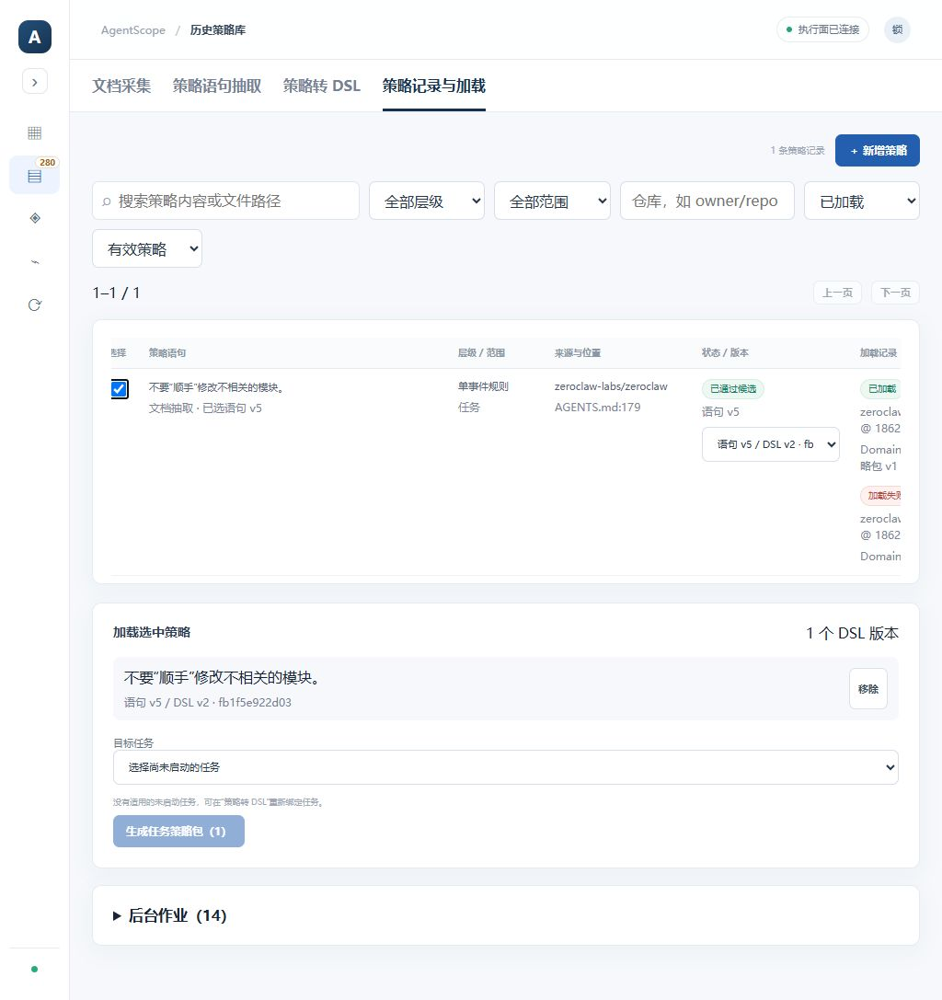
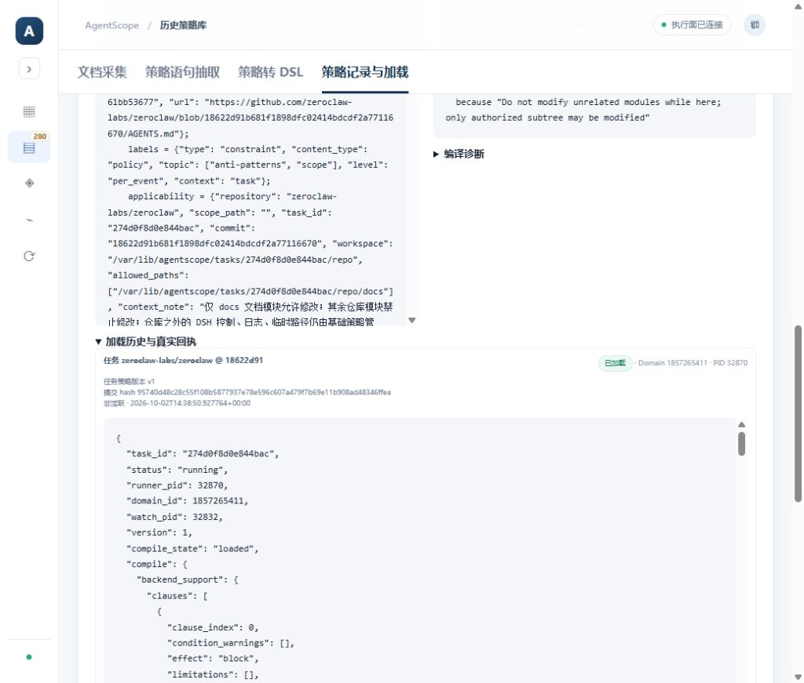

# 策略记录与加载验收 · 2026-10-03

参考 mac 分支 41e5c3d611f05e442fea0c86c62d571655e4b52f 的策略目录管理，Windows 实现统一正文列表、服务器筛选/分页、新增、版本编辑/历史、归档及恢复。导航仍为左侧历史策略库一级入口、右侧四个二级模块。

- 普通 happy 用户：58 项后端测试通过；Vite 生产构建及 Python 编译检查通过。
- 实际原库 282 条策略目录、287 个语句版本、7 个 DSL 产物与迁移前私有备份对照，原文、来源和审批 hash 保留。
- 浏览器验证 1–20 / 282 到 21–40 / 282，已加载筛选、手工记录新增/编辑到目录 v2、修改前 v1 历史、归档/恢复。
- 手工验收记录 __MAC_RECORDS_UI_20261003__ 最终待审并归档，不产生 DSL，不参与执行。
- 选择语句 v5 / DSL v2（fb1f5e922d03），跨模块切换和侧栏收缩保留该版本；展示该 DSL 的来源正文。
- 旧加载记录按确切 DSL 关联真实任务、策略包版本及回执，包含成功 Domain 1009245371 / 1857265411 和已有失败记录。绑定已完成任务的 DSL 不可错选其他任务，重新绑定仍走转换和审核。
- 本轮未调用 DeepSeek、未新启动 DSH；实际执行效果仍以 [2026-10-02 运行验收](history-library-20261002.md) 为准。数据库私有备份不随源码交付。

