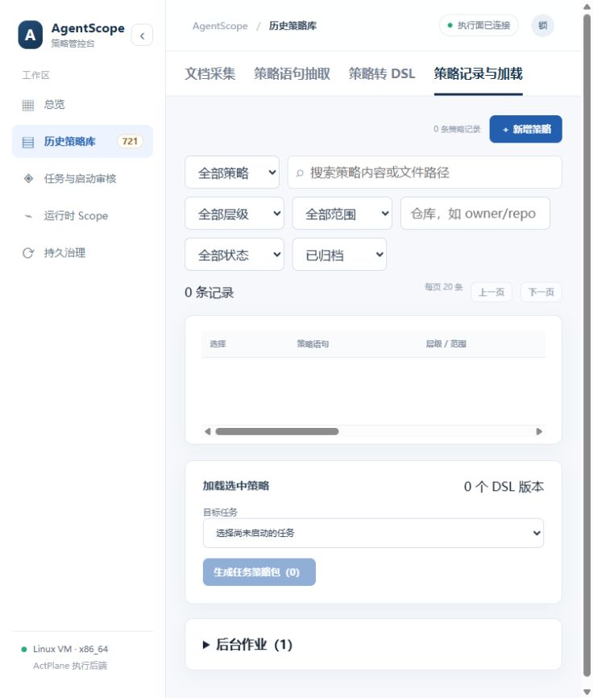
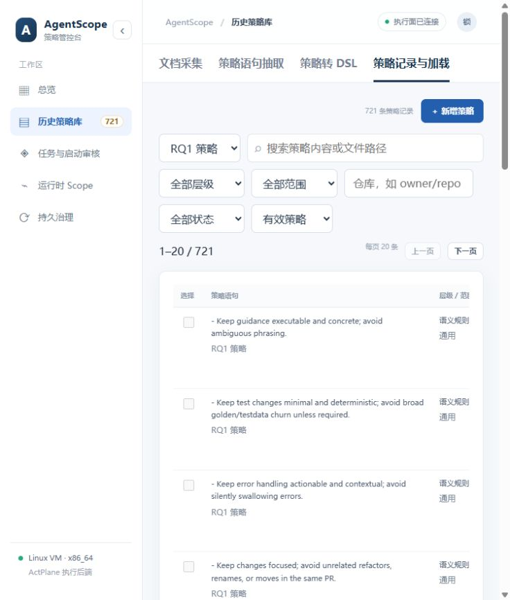

# 非 RQ1 历史记录永久清理验收

日期：2026-10-03。用户明确授权永久删除当前非 RQ1 数据。

原数据为 721 条 RQ1、282 条已归档采集记录、1 条已归档手工记录。现策略目录共 721 条，全部 RQ1；有效/归档/全部来源查询中非 RQ1 均为 0。

关联清理：287 个语句版本、7 个 DSL 产物、1 个修改快照、6 个来源文档、14 个后台作业、4 个编译记录、2 个策略包及关联、3 个部署回执、313 个旧相关审计条目。只保留删除统计审计。删除六份采集快照、四份策略文件和两份含旧记录的备份；SQLite secure_delete、VACUUM、WAL 截断完成。

两个策略包所属任务已结束，runner PID 不存在且部署非活动；删除包后对应活动版本为 0。11 个任务及 8 个无关基础策略版本保留。未启动任务或调用 DeepSeek。

验证：内存数据库预检、重复执行和活动任务拒绝保护通过；删除前后 RQ1 全行指纹一致。实际服务重启后 RQ1 721 条不变，初始播种作业仍只有 1 个。外键检查无错误，integrity_check=ok，64 项后端测试通过。API 默认分页两页均 20 条；浏览器默认显示 1–20 / 721，全部来源的已归档显示 0 条。

结构化结果：[result.json](rq1-only-purge-20261003/result.json)。

