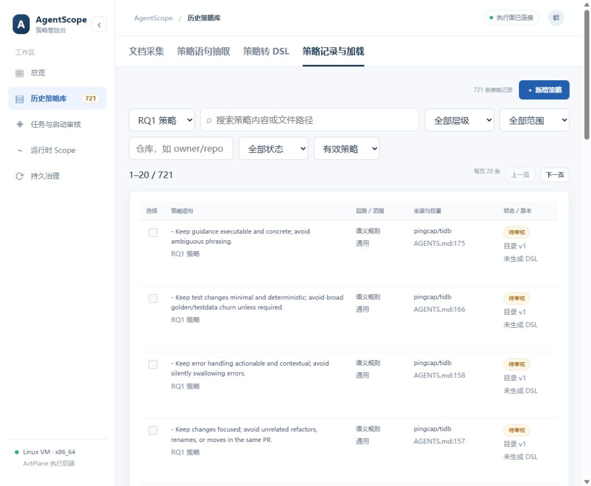
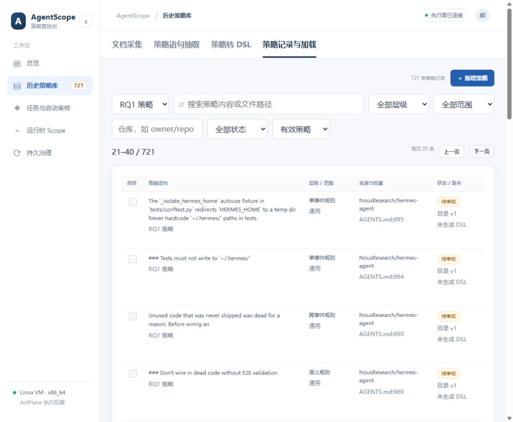

# RQ1 默认库与持久化验收 · 2026-10-03

RQ1 数据来自 ActPlane artifact-ready 固定提交 [63db869](https://github.com/eunomia-bpf/ActPlane/tree/63db86945c9b8618a46aa68c8de214bc4b8343d9/docs/corpus)，候选表 866 行去重为 721 条，区别于论文 607 条 OS 可执行子集。内置文件与 Git blob 及 SHA-256 核对通过。

- 后端 64 项测试、前端生产构建及 Python 源码编译通过。
- 实际初始化作业完成并写入持久 SQLite：721 条、707 源位置已定位、14 未定位、46 个来源仓库；候选均待审核。
- 用户要求的 282 条采集样例已可恢复归档，当前有效采集记录为 0；原 287 个语句版本、7 个 DSL 产物和部署回执完整保留。
- 真实重复导入新增 0；服务重启后记录 ID、正文、状态、版本及来源整体指纹不变，只有一个播种作业。
- 浏览器重启刷新后默认 RQ1，1–20 与 21–40 两页都恰好 20 行，界面显示“每页 20 条”。
- 本轮未调用 DeepSeek 或启动新 DSH；本地数据库私有备份没有导出到源码。

[结构化验收结果](rq1-persistence-20261003/result.json)

