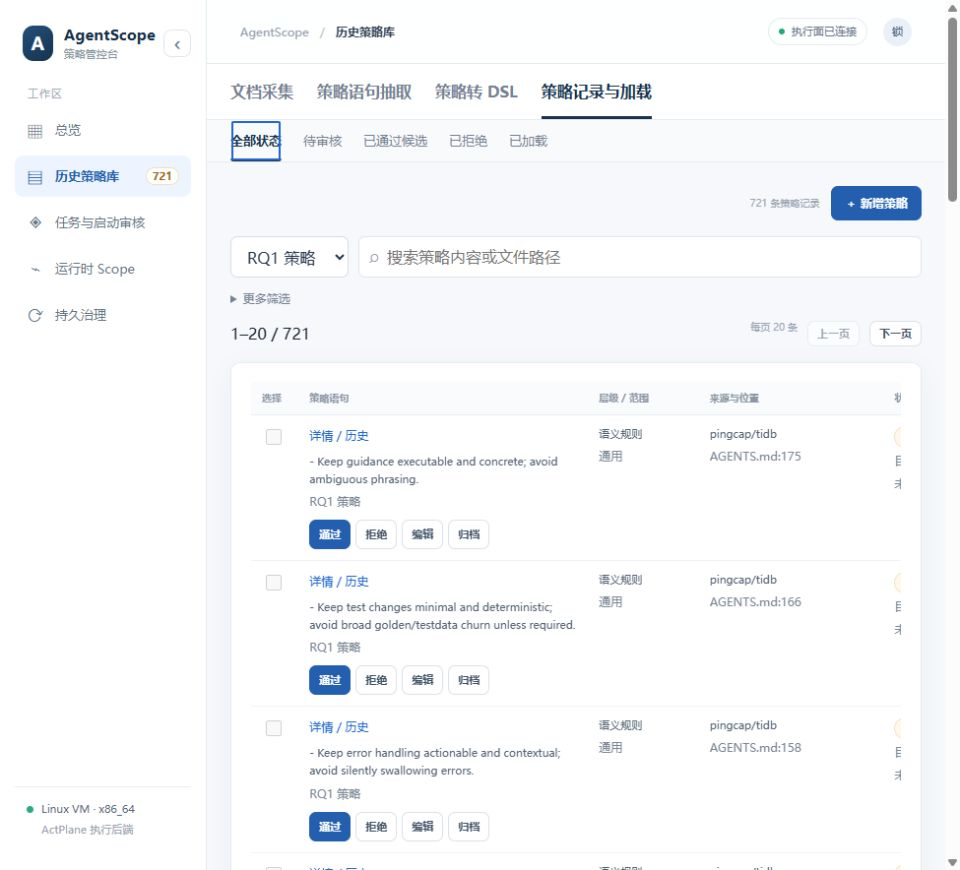
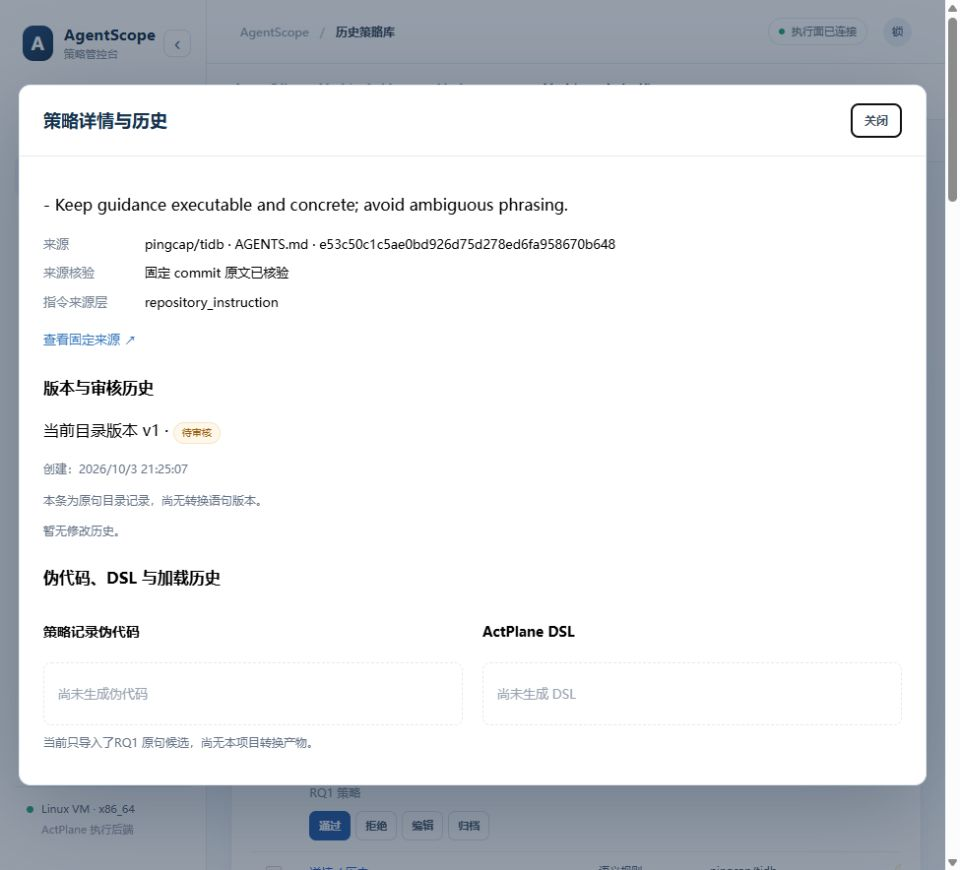

# 三级状态导航与详情验收

日期：2026-10-03。

将全部状态、待审核、已通过候选、已拒绝、已加载改为二级栏下方的三级导航。保留来源/搜索，其他筛选在“更多筛选”中；五个状态沿用 SQL 分页前的过滤，每页 20 条。

详情按钮曾位于 1120px 表格最右列，详情又在二十行表格之后。本次移到正文顶部，打开原生弹窗直接显示来源、当前版本、修改历史和产物状态。窄区域适配卡片，关闭及 Esc 恢复到原按钮。

验证：生产构建通过、64 项后端测试通过。实际浏览器五个状态、Home 切换、跨二级模块保留、20 条分页及状态切换回首页通过；归档筛选为 0。423px 窄视图按钮水平可见，975×884 自然视图入口在首屏内；没有设置视口 override。详情可见、关闭与 Esc 的焦点恢复通过。

数据未改动：721 条 RQ1 全部待审核，非 RQ1 为 0，语句版本及本地 DSL 产物为 0。详情明确显示“尚未生成伪代码”“尚未生成 DSL”。本轮未调用 DeepSeek、未导入研究 DSL、未加载内核规则。

论文固定研究汇总另有 [607/607 编译产物](https://raw.githubusercontent.com/eunomia-bpf/ActPlane/63db86945c9b8618a46aa68c8de214bc4b8343d9/docs/eval_runs/rq1-expressiveness/full-607-subagents/summary.json)。它们与原始候选表并非已建立逐条对应关系，不能自动视为本项目批准版本。

结果：[result.json](status-navigation-details-20261003/result.json)。

