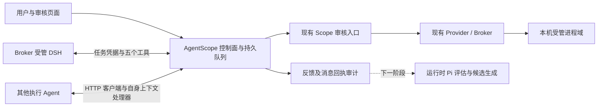

# RFC-20261004：外部 Agent 接入与运行时 Scope 第一版

状态：通信层已实现；运行时 Pi 增量生成与独立生效确认尚未实现。

用户确认范围：现有 DSH + 通用 HTTP 适配器。对应源码分支
`codex/runtime-agent-bridge-v1`，基线 `2e23c4645a33a2088b628da744dba65078d99491`。
设计参照新传入的《AgentScope_运行时Scope增量与策略生成技术方案.md》；该文件
SHA-256 为 `cddcd20482562995a8623f3904983edd5ce0d915f0a4a9a44cb512ed74f0b91a`。
原方案中的 ARM64/Mac 路径不是本轮部署事实；本轮使用现有 Windows/WSL x86_64 独立开发实例。

## 1. 如何联系外部 Agent

AgentScope 提供任务级 HTTP 合同，执行 Agent 用适配器主动读取并提交。
DSH 通过五个原生工具接入；其他 Agent 将 Python 客户端接到自身任务/session
处理器。通信接口既不是通用聊天转发器，也不接管外部 Agent 的自主规划。

本机进程域限制由执行主机的 Broker/ActPlane 承担；远程 HTTP 连接只获得通信
能力。Task ID、令牌、Agent 自报 PID 都不能证明远端进程被本机内核约束。
`context` 的 `task_binding_confirmed` 来自实际 Broker 域/PID 回查，只指受管任务；
`connection_process_attested` 固定 false。

## 2. 第一版职责

| 环节 | 第一版行为 |
|---|---|
| 任务启动 | 沿用 GitHub 固定 commit、启动策略审核、Provider/Broker 受管 DSH |
| DSH 接入 | 已签发任务凭据首次调用桥接接口时登记；不需要另输管理员口令 |
| HTTP 接入 | 控制操作员为运行中的已批准任务创建限时连接；返回一次性明文令牌，数据库只存摘要 |
| Scope 读取 | 返回批准版本、包 hash、执行批次、目录、限制及上下文 hash |
| 用户消息 | 持久化后等待 Agent 主动读取，分别记录 received 与 handled |
| 工具/任务反馈 | 固定结构与长度限制，标记 agent_report，不写入内核事件表 |
| Scope 请求 | 幂等提交至既有人工审批，绑定当前运行和 Scope hash；变更后旧申请不可批准 |
| 审核反馈 | 审核结果变成可重放的消息，保留现有执行回执，不宣称桥接层验证了内核效果 |
| 页面 | 独立“运行时 Agent 接入”：连接、消息、回执、反馈；历史策略库保持原布局及数据 |

当前阶段不会自动启动运行时 Pi，也不会生成/追加运行时 DSL。反馈明确返回
`assessment_status=not_scheduled`，运行状态为 `runtime_pi=not_connected`。
新用户语义要求通过消息送达不等于即时生效。需要即时保证的限制应暂停受影响
操作并走受控执行接口；第一版能力表明确不支持上下文主动推送、暂停和会话恢复，
不能据此宣称实现了这部分第三层合同。

## 3. 接口合同

协议：`agentscope.agent-bridge/v1`。

| 权限面 | 接口 | 行为 |
|---|---|---|
| 控制面 | POST `/api/tasks/{task_id}/agent-connections` | 为已有运行任务创建 HTTP 接入凭据，60–86400 秒，默认 3600 秒 |
| 控制面 | POST `/api/tasks/{task_id}/agent-connections/{id}/revoke` | 撤销连接；DSH 连接同时撤销其旧插件凭据 |
| 控制面 | GET `/api/tasks/{task_id}/agent-bridge` | 查看最近 100 条连接、消息及反馈，不返回令牌或其摘要 |
| 控制面 | POST `/api/tasks/{task_id}/agent-messages` | 以 request_key 幂等发送用户任务消息 |
| Agent 面 | GET `/api/agent/tasks/{task_id}/context` | 读取当前批准 Scope，兼作通信活跃记录 |
| Agent 面 | GET `/api/agent/tasks/{task_id}/messages?after=0&limit=20` | 按持久序号升序读取，最大 100 条 |
| Agent 面 | POST `/api/agent/tasks/{task_id}/messages/{id}/ack` | received/handled 回执，状态不降级 |
| Agent 面 | POST `/api/agent/tasks/{task_id}/feedback` | progress/tool_feedback/scope_blocked/result |
| Agent 面 | POST `/api/agent/tasks/{task_id}/scope-requests` | restrict/expand；保留仓库路径与 RQ5 首版限制 |

Agent 面每个接口自行检查任务凭据，不使用开发免口令豁免。凭据不能创建连接、
批准版本、调用生成器或加载策略。控制面继续保留已有“仅回环开发免口令”配置。

反馈和 Scope 请求必须提供 `request_key` 及 `expected_snapshot_hash`。同一连接
相同键和内容复用保存结果；同键不同内容返回 409；首次提交使用过期 Scope hash
返回 409。请求与持久化在同一 SQLite 写事务中完成。scope 申请另存运行/hash
绑定，在批准入口检查，拒绝可以关闭过期申请。

执行批次 `run_key` 由任务、批准策略 ID、部署 ID、域/PID/watch 组成；restart
或重新部署会改变它。首次 DSH 登记有效期 24 小时，任务结束、停止、撤销或重启
均不能继续使用旧连接；不隐式换发跨批次权限。

## 4. 消息与上下文更新

HTTP 客户端使用同步标准库；调度由外部 Agent 的适配器负责，建议活跃时每 2 秒
拉取，错误退避不超过 30 秒。DSH 第一版通过消息工具拉取；不具备打断模型并
立即注入消息的能力。

收到消息先回传 received，再由适配器调用执行 Agent 的真实 session/context
更新接口，成功处理并持久化后才回传 handled。以消息 ID 保证 handler 幂等。
整批处理完之前不得持久推进 after 游标。断线重连从旧游标读取，服务重启不会
丢掉队列/回执。消息保存在所属执行批次，旧用户消息不会交给新进程。
`handled` 是 Agent 自报；无法据此证明模型遵从、任务完成或内核规则生效。

第一版接口允许提交事实摘要，限制长度并遮蔽常见 Bearer/API key/password
格式；不提供通用敏感数据识别保证。禁止上传原始敏感日志、凭据或模型私有推理。

## 5. DSH 工具与其他 Agent 示例

DSH 包 `@agentscope/dsh-policy@0.2.0`：

1. `agentscope_get_current_scope`
2. `agentscope_request_scope_change`
3. `agentscope_read_messages`
4. `agentscope_acknowledge_message`
5. `agentscope_report_feedback`

其他 Agent 使用 `integrations/http-agent/agentscope_client.py`。输入为明确的
AgentScope origin、Task ID、任务接入令牌；不会把用户选择的模型或 Agent 换成
Pi。外部 Agent 的消息 handler 必须由实际产品/运行时适配，不能将示例 handler
当成任意 Agent 已连接的证明。

远端客户端必须 HTTPS 并使用可信证书；当前 18002 API 仍绑定 127.0.0.1，
本轮没有开放公网、配置远程代理或安装新的 Agent。客户端仅允许回环 HTTP。

## 6. 下一阶段与完整第三层

在该通信合同上继续接入运行时 Pi：多源触发器→去重→上下文快照→独立一次性
Pi→结构化评估/PolicyIR→确定性 DSL→编译→人工审核→Broker 提交→独立生效确认。
用户输入、Agent 反馈、内核事件使用不同来源与授权等级；每任务一个 Pi 作业与
一个 apply 锁。批准、提交、实际 active 分开；动态规则受现有 ABI/能力限制；
扩权形成新整包并重启，不伪装成运行中解除限制。新运行重新连接，不能声称 DSH
自动恢复旧对话。历史提升另行审核。

第一版验收入口：`scripts/agent_bridge_acceptance.py`。固定 GitHub commit，
运行真实 DSH 与真实 HTTP 适配器，检查读取、收发、回执、审核拒绝通知、完成
撤销及历史库指纹。此实验验证通信，不替代未来增量 DSL 的允许/拒绝探针。
