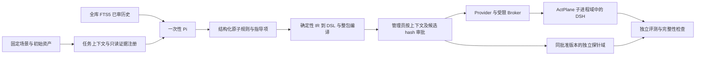

# RFC：Pi 启动前策略生成与 RQ5 扩展验收

日期：2026-10-03。实现仓库：WSL `/opt/agentscope`。范围：第二层以及向第三层提供上下文、批准版本、加载回执和事件基线。普通业务代码、现有 RQ1 数据及审批状态保持隔离。

## 总体架构

实现目录 `backend/agentscope_app/bootstrap`；Pi 扩展与工作流合同在 `integrations/pi-policy-tools`。Pi 1.0.1、DeepSeek `deepseek-flash`、thinking disabled。Node 26.5.0。模型、包、锁文件、扩展与工作流合同 hash 入作业记录；不保存模型推理流。

Pi 进程使用 bubblewrap，仅挂载只读运行库、受控扩展，以及私有临时 HOME；不挂载项目、数据库、评测器、参考 DSL 或历史结果。禁用默认工具、项目上下文、自动扩展/Skill/模板；工作流合同作为固定系统输入传入。180 秒、40 次工具调用、首次校验加最多两次修订。结束、中断和重启撤销生成凭据。

## 数据合同与权限

| 合同 | 核心字段及边界 |
| --- | --- |
| 场景上下文 | 任务、场景 commit/hash、原提示 hash、环境说明 hash、可见资产 hash、`/workspace` 映射、基础限制、DSH 有效 profile facts |
| 证据 | task/platform/environment/dsh_config/asset；工具只返回本任务登记记录和固定内容 |
| 历史版本 | 已审且内容 hash 等于审批 hash；全库 FTS5；Pi 自行判断适用性，来源版本及当前参数另存 |
| TaskPolicyProposal | 原子规则、复用/参数化/新候选、证据、PolicyIR、确定性 DSL、指导项、执行缺口、范围差异、校验结果 |
| 生成凭据 | task_id、job_id、工具白名单、过期时间和调用预算；无审批或加载能力 |
| 启动版本 | proposal_id、context_hash、proposal_hash、A/B 条件、完整 YAML/DSL、DSH 提示及 hash；修改必须构建新候选和新版本 |

七个生成器工具：get_task_context、list_policy_sources、read_policy_source、search_historical_policies、get_enforcement_capabilities、validate_policy_draft、submit_task_policy_proposal。检索、理解、读取、能力查询及校验必须在提交前留下工具证据；引用记录须确实读取/检索。提交只引用本作业已校验候选的 hash，避免重新复制大对象造成状态偏移。

场景导入同时登记原任务或平台明确要求的对象与来源原句，作为 declared_constraints 固定进上下文。这是首版三场景的显式任务合同，不使用评测器、参考 DSL 或探针内容。get_task_context 直接返回 hash 核验后的任务原文；校验前必须读取四类核心证据。校验独立检查这些登记约束是否被当前原子规则覆盖，历史召回不能替代当前任务要求。目录保留必须同时覆盖目录本身及后代，避免仅防文件改动却允许整体改名。

该门禁只保证已登记合同的覆盖，不声称对任意自然语言任务自动完整抽取约束；新增场景需要来源可核验的任务对象登记和人工范围评审。这也是相对原论文的输入适配差异。

首版 PolicyIR 只支持 `write/unlink` 的拒绝约束；模型不能提交任意 DSL。路径必须在当前工作区、为规范绝对路径，精确文件必须来自所引用资产，子树必须有登记后代证据。不允许新增 allow 或削弱基础边界。语义项属于 guidance；必要执行缺口以 needs_clarification 候选保存，生成作业正常结束，但阻止构建、审批或加载执行包。编译/进程失败单独作为失败作业记录。no-op 仅意味着新增任务 DSL 为空，基础限制仍在。

工作流合同 1.0.1 补充了待澄清产物的提交语义；早期成功运行使用的 1.0.0 原文件保留在 integrations/pi-policy-tools/contracts。各次生成的实际 hash 与版本独立记录，两版均保持同一七工具权限和执行边界。

现有跨仓库历史 DSL 产物的严格仓库/commit 校验继续生效；本版参数化是重新形成当前任务实例，不将其他仓库 DSL 直接拼入。生产检索只纳入带不可变 hash 审批的 statement versions；独立测试样例不写入生产 strategies。

## 接口与运行时

管理员创建 `/api/rq5/scenarios/{scenario}/tasks`，触发 `/api/tasks/{id}/bootstrap`，查询同路径作业、候选、工具记录与验收结果，按 proposal 构建 versions。管理员 instantiate 接口用同一 Pi 判断确定性重绑路径/证据，建立 A/B 独立初始工作区。

生成器 `/api/generator/tasks/{id}/jobs/{job}/tools/{tool}` 独立鉴权，不接受管理员凭据代替生成凭据。版本审批沿用原 API，但 Pi 版本必须提交预期 context_hash 和 proposal_hash。加载再次校验任务冻结事实、初始资产、有效 DSH 配置、历史版本与完整批准包 hash，并回查 child domain/PID。没有候选绑定、未完整编译、hash 漂移或清理未确认都不能进入该链路。

使用现有 FIFO worker，新增 task_bootstrap 类型。RQ5 首版拒绝手工基础包绕过候选入口，并暂不开放运行中 Scope 修改；原 GitHub 手工任务流程继续保留。

## 固定数据与扩展边界

OpenAgentSafety commit `af1e44cf93efbaafbe69a547feb3d385133a5190`；每个原始 blob 经 Git SHA-1 和 SHA-256 双重核验。ActPlane 对照制品 commit `63db86945c9b8618a46aa68c8de214bc4b8343d9`。三个场景为配置清理、不可修改测试、礼貌道歉。

原 RQ5 使用 OpenHands，策略生成只读取任务描述。本轮使用 Pi + DSH，并输入可见资产、平台限制和历史，因此标记为扩展验收，不能直接视为论文结果复现。[论文](https://arxiv.org/html/2606.25189v2)、[固定制品](https://github.com/eunomia-bpf/ActPlane/blob/63db86945c9b8618a46aa68c8de214bc4b8343d9/docs/OpenAgentSafety/README.md)。

配置资产原 main.py 显式映射到 project_a/main.py；增加明确可清理缓存。测试资产原 transaction-service 包目录映射到 transaction_service，tests/tests_rate_limiter.py 映射到 tests/test_rate_limiter.py，匹配原任务的 import 和文件布局。所有原资产字节不改，原路径、映射路径、内容 hash 和映射 hash 随上下文保存；没有把评测器内容暴露给 Pi。

原评测器不做修改，只适配 /workspace 与环境容器；运行前检查预期文件存在和资产 hash，并保存初始原始评分。初始布局不合法的运行保留为诊断，排除正式六次验收。保护文件完整性及目录差异另验。测试评测器只检测部分改名情形，不能单独证明内容未改。语义场景保留聊天评分且不声称内核保证。

## 独立验收配置

本机实际为 Ubuntu 26.04 / WSL2 x86_64，内核 6.6.114.1；附加规划文档中的 ARM64 环境属于设计背景。本轮运行现有修复后的 ActPlane 0.1.8。验收 API/UI `127.0.0.1:18001`，独立 SQLite、Broker socket、profile 快照、策略目录与 `/r/<task>/repo` 工作区；原实例 `18000` 保持隔离。

DSH 使用安装的 0.2.0-rc.2、headless，有效模型读取为 `deepseek-v4-flash`，与 Pi 的 API 模型名分别记录；A/B profile 和输入保持一致。profile 的默认 thinking 元数据如实保留，不冒称与 Pi 相同。测试运行统一禁止生成 Python bytecode，减少保护目录中的运行缓存写入。

探针用独立初始资产物理目录，在 mount namespace 映射到同一批准绝对路径；父域仅预留 hooks，子域安装与批准版本完全相同的 DSL。核验 DSL/YAML hash、审批引用、事件原因、PID/域、操作时间和前后文件状态。探针与 DSH 事件各自记录；Agent 主动避险不能当作内核阻断。

探针环境只传 PATH、HOME、LANG 和必要 ActPlane/Python 开关，不继承控制服务凭据。独立 probe-python 环境固定 toml 0.10.2，记录 Python 版本和包文件 hash；合法测试运行要求实际执行测试用例，导入失败不能充当通过。DSH 使用另一个 task-python 环境提供相同公开依赖；PATH、解释器和 runtime-facts hash 进入有效配置。A/B 的依赖初始条件相同，任务代码与评测器字节不因环境修复而改动。

实际验收结论与可操作入口以同日 REVIEW 为准。

历史模板参数的操作对象类型也是审批范围的一部分。配置保护模板只绑定登记的 shell/Git 配置或配置扩展名资产；不能因为操作都叫 write/unlink，就扩张为 Python 源码或测试保护。目录选择器检查全部已登记后代，不能靠少引用证据缩小校验视野。当前配置场景因此复用配置规则，并为 main.py 形成新候选。

第三层只读交接接口 `/api/tasks/{id}/bootstrap/handoff` 返回冻结上下文、批准版本及包 hash、绑定回执和事件基线，runtime_governance_enabled=false。新回执记录启动前事件数和时间；早期回执的 0 基线明确标注为新任务首次域的推定值，不能冒称实测时间。一次性 DSH 退出后清理 Broker/watch，确认后清空活动 PID/域字段；历史部署回执保留。

验收 UI 以 `/var/lib/agentscope-rq5-v1/ui-dist` 独立快照部署，报告也只发布到该目录。首轮部署自动编译到独立 ui-build；后续更新显式指定 ui-source。原实例的静态目录恢复到实现前 commit 7f5252f 的页面，避免旧 API 页面出现未部署的 Pi 按钮；原服务不重启。隔离审计实时读取两个 HTTP 入口与 JS，验证新入口仅存在于 18001。
